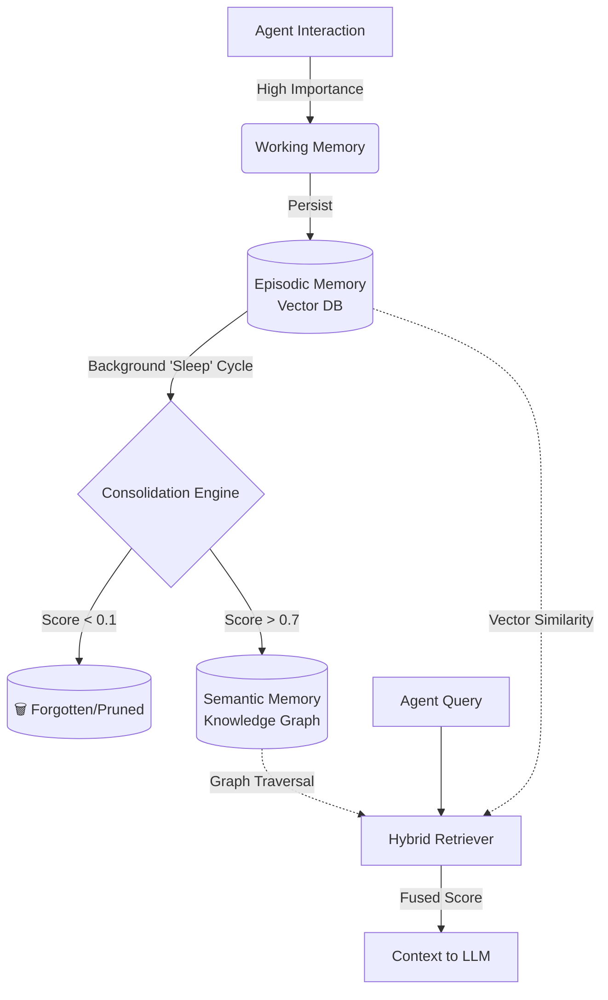

---

#  CogniMem: Human-Inspired Cognitive Memory for AI Agents

[](https://www.python.org/downloads/)
[](https://opensource.org/licenses/MIT)
[](https://github.com/astral-sh/uv)

Stop giving your AI agents amnesia or infinite, noisy context windows. **CogniMem** is an open-source, biologically inspired memory architecture that allows AI agents to remember, forget, and learn just like humans do. 

Unlike static RAG or simple sliding-window contexts, CogniMem implements a tripartite memory system governed by a background **Consolidation Engine**. It requires only **minor code changes** to integrate with almost any existing AI agent framework.

##  Key Features

- ** Tripartite Memory Architecture**: Separates memory into *Working* (short-term cache), *Episodic* (vector-based experiences), and *Semantic* (graph-based distilled facts).
- ** Ebbinghaus Forgetting Curve**: Automatically decays the importance of unused memories over time and prunes irrelevant data, preventing context poisoning.
- ** Hybrid Associative Retrieval**: Combines vector similarity with cognitive importance scores and graph relationships for human-like, context-aware recall.
- ** Framework Agnostic**: Drop-in wrappers for LangChain, AutoGen, CrewAI, and a universal SDK for custom Python/Node.js agents.
- ** `uv` Optimized**: Lightning-fast dependency resolution and deterministic locking out of the box.

---

##  Installation

CogniMem is designed to work seamlessly with modern Python tooling. We highly recommend using [`uv`](https://github.com/astral-sh/uv) for blazing-fast setup.

### Option 1: Install from PyPI (Coming Soon)
```bash
uv pip install cognimem
```

### Option 2: Install from Source (Recommended for now)
```bash
# 1. Clone the repository
git clone https://github.com/your-username/cognimem.git
cd cognimem

# 2. Install dependencies and the package in editable mode using uv
uv pip install -e .
```

---

##  Quick Start

Here is how easy it is to give your agent a human-like memory.

```python
from cognimem.sdk import CogniMem

# 1. Initialize the memory system with a unique agent ID
agent_memory = CogniMem(agent_id="research_assistant_01")

# 2. Remember an interaction (assign an importance score and tags)
agent_memory.remember(
    content="The user prefers Python over Java for backend development.",
    importance=0.9,
    tags=["user_preference", "python", "backend"]
)

agent_memory.remember(
    content="We discussed deploying the app using Docker yesterday.",
    importance=0.5,
    tags=["project", "docker"]
)

# 3. Recall context before generating the next LLM response
query = "What programming language does the user like?"
context = agent_memory.recall(query, top_k=2)

print("--- Retrieved Context ---")
print(context)
```

---

## 🔌 Agent Integrations

CogniMem is built to require **minor changes** to your existing codebase. Choose your framework below:

### 1. LangChain / LangGraph
Replace your standard `ConversationBufferMemory` or `VectorStoreRetrieverMemory` with our drop-in wrapper.

```python
from langchain_openai import ChatOpenAI
from langchain.agents import AgentExecutor, create_tool_calling_agent
from cognimem.integrations.langchain_wrapper import CogniMemChatHistory

# Initialize the memory backend
memory = CogniMemChatHistory(agent_id="langchain_agent_01")

# Pass it to your agent
llm = ChatOpenAI(model="gpt-4o", temperature=0)
# ... setup your tools and prompt ...
agent = create_tool_calling_agent(llm, tools, prompt)
agent_executor = AgentExecutor(agent=agent, tools=tools, memory=memory, verbose=True)

# The agent will now automatically remember and recall using CogniMem!
agent_executor.invoke({"input": "What did we talk about regarding Docker?"})
```

### 2. AutoGen
Inject CogniMem into AutoGen using a custom tool or a reply hook to maintain state across conversations.

```python
import autogen
from cognimem.sdk import CogniMem

memory = CogniMem(agent_id="autogen_coder")

def recall_memory_tool(query: str) -> str:
    """Use this tool to remember past interactions with the user."""
    return memory.recall(query, top_k=3)

def remember_hook(sender, message, recipient, silent):
    """Automatically remember significant messages."""
    if "IMPORTANT:" in message:
        memory.remember(message, importance=0.8, tags=["autogen_log"])
    return message

# Attach the hook to your agent
coder = autogen.AssistantAgent(
    name="coder",
    llm_config={"config_list": [{"model": "gpt-4o"}]},
)
coder.register_reply([autogen.Agent, None], remember_hook)

# Provide the recall tool to the agent
tools = [{"type": "function", "function": {"name": "recall_memory_tool", "description": "...", "parameters": {"type": "object", "properties": {"query": {"type": "string"}}}}}]
coder.update_tool_signature(tools, is_remove=False)
```

### 3. CrewAI
Use CogniMem as a custom tool for your CrewAI agents to give them long-term persistence across different tasks and runs.

```python
from crewai import Agent, Task, Crew
from crewai_tools import tool
from cognimem.sdk import CogniMem

memory = CogniMem(agent_id="crewai_researcher")

@tool("Recall Past Research")
def recall_research(query: str) -> str:
    """Searches long-term memory for past research findings."""
    return memory.recall(query, top_k=3)

researcher = Agent(
    role='Senior Researcher',
    goal='Uncover groundbreaking technologies',
    backstory='You rely on your extensive, organized memory of past projects.',
    tools=[recall_research],
    verbose=True
)

# ... define tasks and crew as usual ...
```

---

##  Configuration

CogniMem is highly tunable via the `config.yaml` file. You can adjust how "human" the forgetting and learning process is:

```yaml
memory:
  working_memory_limit: 10       # Max items in immediate short-term cache
  consolidation_interval_hours: 6 # How often the "sleep cycle" runs
  decay_constant_k: 24           # Ebbinghaus curve: Higher = slower forgetting
  promotion_threshold: 0.7       # Score required to move Episodic -> Semantic (Fact)
  pruning_threshold: 0.1         # Score below which memory is permanently forgotten
retrieval:
  vector_weight: 0.6             # Weight of semantic/vector similarity in recall
  importance_weight: 0.4         # Weight of memory importance/recency in recall
```

---

## How It Works (Under the Hood)



1. **Ingestion**: New information enters Working Memory, then persists to Episodic Memory (ChromaDB) with an `importance_score`.
2. **Consolidation**: A background scheduler periodically applies the *Ebbinghaus Forgetting Curve*. Trivial memories decay and are deleted. Crucial memories are distilled and promoted to the Semantic Graph (NetworkX).
3. **Retrieval**: When the agent queries memory, the `HybridRetriever` fuses vector similarity (what the text says) with cognitive importance (how relevant it is to the agent's goals), returning the most "human-like" associative match.

---

##  Contributing

We welcome contributions! Whether it's adding support for a new agent framework (e.g., LlamaIndex, Microsoft Autogen Studio), improving the graph distillation logic, or fixing bugs, please feel free to open an Issue or submit a Pull Request.

1. Fork the repository.
2. Create your feature branch (`uv run -m venv .venv` and `uv pip install -e ".[dev]"`).
3. Commit your changes (`git commit -m 'Add some feature'`).
4. Push to the branch (`git push origin feature/new-integration`).
5. Open a Pull Request.

---

## 📜 License

This project is licensed under the **MIT License** - see the [LICENSE](LICENSE) file for details. Feel free to use it in commercial and open-source agentic AI projects.

---

###💡 Pro Tip for Developers:
If you are building a multi-agent system, simply instantiate `CogniMem(agent_id="shared_team_memory")` for all agents to give them a **collective hive-mind**, or use unique IDs (`agent_id="agent_a"`) to give them distinct, personalized personalities and experiences!